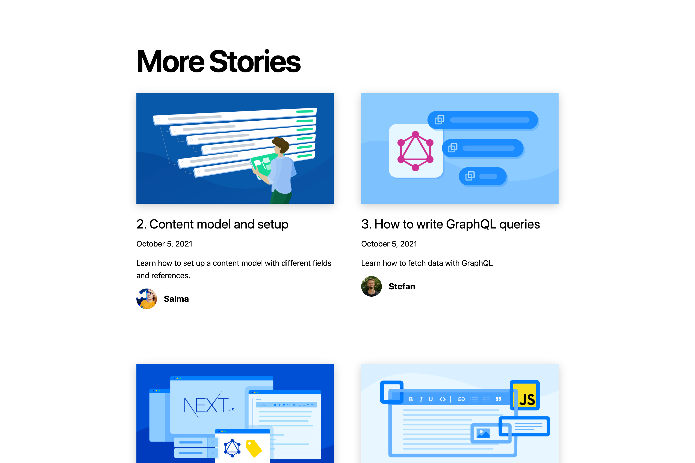

# Getting started with Next.js and Contentful

Next.js is a powerful Static Site Generator powered by React that gives you exceptional flexibility
in how you fetch, pre-render and update the content that powers your web applications. In
combination with Contentful — the headless content management platform — you can build, iterate,
scale and deploy your content with ease.

In this workshop, [Salma](https://twitter.com/whitep4nth3r) and
[Stefan](https://twitter.com/stefanjudis) will guide you through a fresh blog setup with Contentful
and Next.js.

You'll learn how to use Contentful's GraphQL API to generate dynamic pre-rendered static pages based
on your blog entries, you'll explore the power of Contentful's Rich Text Field (it's so much nicer
than a traditional WYSIWYG editor!) and understand how you can rebuild your website on content
changes with either webhooks or Incremental Static Regeneration from Next.js.

### [Click here to view the workshop outline](https://contentful-jamstack-workshop.vercel.app/)

